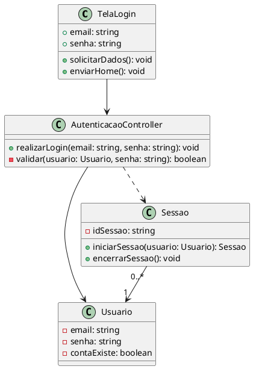
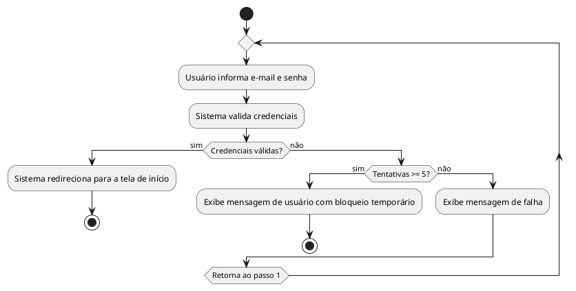

## UC01 — Realizar Login

### Ator Principal
Usuário

### Objetivo
Acessar o sistema após autenticação ser válida.

### Pré-condições
- Possui uma conta ativa.

### Pós-condições
- Iniciar sessão.

### Fluxo Principal
1. Usuário informa e-mail e senha.
2. Sistema valida credenciais.
3. Sistema redireciona para a tela de início.

### Fluxos Alternativos
- **A1 — Credenciais inválidas:**
  1. Sistema rejeita credenciais.
  2. Exibe mensagem de falha.
  3. Retorna ao passo 1 do fluxo principal.

- **A2 — Usuário bloqueado:**
  1. Sistema detecta as tentativas excedidas.
  2. Exibe mensagem de usuário com bloqueio temporário.

### RF Relacionados
- RF01 Login

### RNF Relacionados
- RNF01 Resposta em até 2s

### RN Relacionadas
- RN03: Bloqueio após 5 tentativas inválidas.

---

### Diagrama de Classe

### Diagrama:

---
### Diagrama de Fluxo de Atividade

### Diagrama:

