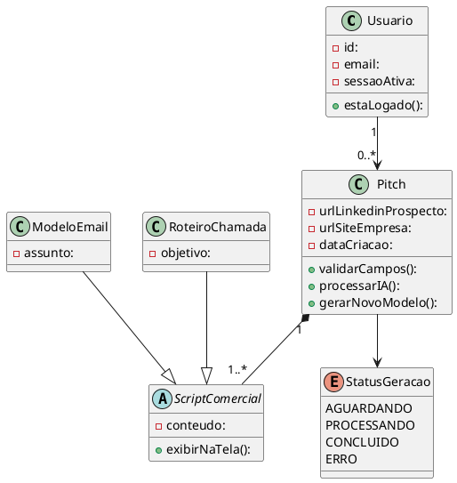

## Caso de Uso: Gerar Pitch de Vendas Personalizado

### Ator Principal
Usuário

### Objetivo
Extrair dados de URLs e gerar scripts comerciais hiperpersonalizados utilizando Inteligência Artificial.

### Pré-condições
- Possuir uma sessão ativa (logado).

### Pós-condições
- Modelos de e-mail e roteiros de chamada são exibidos na tela.

### Fluxo Principal
1. Usuário informa a URL do LinkedIn do prospecto e a URL do site da empresa.
2. Sistema valida os formatos dos links e habilita a pesquisa.
3. Usuário solicita a geração do pitch.
4. Sistema extrai os dados, processa com a IA e exibe o status de carregamento.
5. Sistema apresenta os modelos de script gerados.

### Fluxos Alternativos
- **A1) Campos incompletos**
  1. Sistema detecta que apenas um link foi inserido.
  2. Mantém o botão de pesquisa desabilitado.

- **A2) Formato de URL inválido**
  1. Sistema detecta que a URL não pertence ao LinkedIn.
  2. Exibe mensagem de erro de validação.
  3. Retorna ao passo 1 do fluxo principal.

- **A3) Gerar novo modelo**
  1. Usuário clica na opção de gerar nova versão a partir do resultado atual.
  2. Sistema consome a IA novamente e exibe um novo modelo sem precisar buscar a URL novamente.

### Regras de Negócio
- RN04: O botão de pesquisa só deve ser habilitado se ambos os campos estiverem preenchidos.
- RN05: O sistema só deve processar URLs do LinkedIn.

### Requisitos Relacionados
- RF05 Entrada de URLs Para Pesquisa
- RF06 Atualização do Processo
- RF07 Geração de Scripts
- RF08 Apresentação dos Modelos Gerados
- RF09 Gerar Novo Modelo
- RNF01 Tempo de Resposta em até 5 segundos
- RNF08 Conformidade com LGPD
- RNF09 Usabilidade em até 3 etapas

---

### Diagrama de Atividade (UC02)

### Diagrama:

---

### Diagrama de Classe (UC02)

### Diagrama:

---
