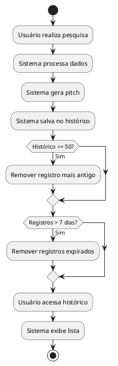
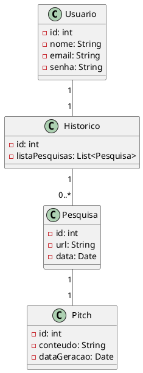

## Caso de Uso: Gerenciar Histórico

### Ator Principal
Usuário

### Objetivo
Manter o controle das pesquisas recentes de URLs e geração de pitches.

### Pré-condições
- Possuir uma sessão ativa e ter realizado pelo menos uma pesquisa.

### Pós-condições
- Histórico atualizado.

### Fluxo Principal
1. Usuário realiza uma pesquisa de pitch.
2. Sistema salva automaticamente a pesquisa no histórico em segundo plano.

### Fluxos Alternativos
- **A1) Limite de histórico atingido**
  1. Sistema detecta que o histórico atingiu 50 pesquisas.
  2. Exclui o registro mais antigo ao salvar a nova pesquisa.

- **A2) Limpeza de histórico expirado**
  1. Sistema identifica registros no histórico com mais de 7 dias.
  2. Deleta automaticamente os registros excedentes.

### Regras de Negócio
- RN06: O histórico deve armazenar apenas as últimas 50 pesquisas realizadas pelo usuário.

### Requisitos Relacionados
- RF10 Histórico
- RF11 Deletar Histórico

---

### Diagrama de Atividade (UC03)

### Exibição:

---

### Diagrama de Classe (UC03)

### Exibição:

---
