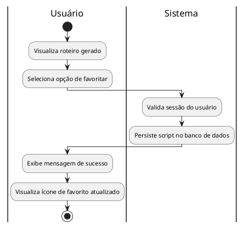
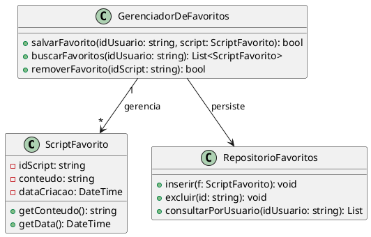

## Caso de Uso: Gerenciar Favoritos

### Ator Principal
Usuário

### Objetivo
Armazenar roteiros bem-sucedidos para fácil acesso posterior.

### Pré-condições
- Possuir uma sessão ativa e ter gerado pelo menos um roteiro.

### Pós-condições
- Script salvo na lista de favoritos.

### Fluxo Principal
1. Usuário marca um script gerado como favorito.
2. Sistema salva o roteiro na lista de Favoritos.
3. Usuário acessa a tela de Favoritos e visualiza a lista.

### Fluxos Alternativos
- Não se aplica.

### Regras de Negócio
- Não se aplica.

### Requisitos Relacionados
- RF12 Favoritar Scripts
- RF13 Lista de Favoritos

---

Fluxos Detalhados
Fluxo Principal (Salvar Favorito): Com o login ativo, o usuário escolhe um dos roteiros de pitch gerados pelo SmartPitch. Ao clicar no ícone de estrela para favoritar, o sistema valida a requisição e grava o conteúdo do script no banco de dados (Firebase), atrelando-o ao ID do usuário. Assim que a gravação termina, a interface mostra um feedback visual de sucesso e atualiza o estado do ícone de favorito em tempo real.

#### Diagrama de Atividade (UC04)

### Exibição de diagrama:

---

#### Diagrama de Classes (UC04)

### Exibição de diagrama:

---
