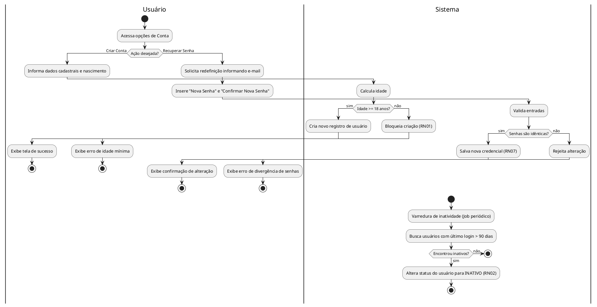
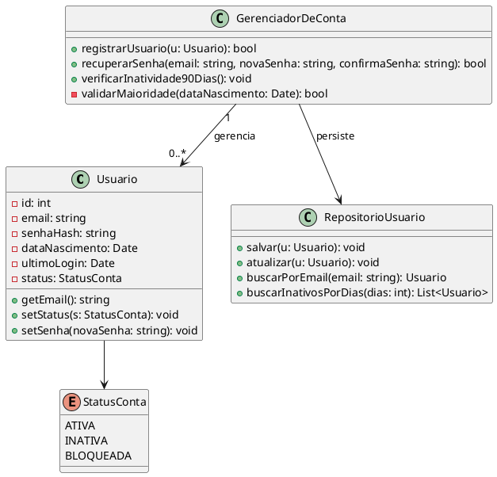

## Caso de Uso: Gerenciar Conta

### Ator Principal
Usuário

### Objetivo
Criar novas contas, recuperar acessos perdidos e gerenciar o status da conta do usuário.

### Pré-condições
- Aplicativo instalado e com conexão à internet.

### Pós-condições
- Conta criada, senha redefinida ou conta bloqueada por inatividade.

### Fluxo Principal
1. Usuário acessa a tela de registro e informa os dados.
2. Sistema valida se a idade é superior a 18 anos.
3. Sistema cria o novo registro de usuário.

### Fluxos Alternativos
- **A1) Recuperação de senha**
  1. Usuário solicita redefinição informando o e-mail.
  2. Usuário insere "Nova Senha" e "Confirmar Nova Senha".
  3. Sistema valida se os campos são idênticos e salva a nova credencial.

- **A2) Bloqueio por inatividade**
  1. Sistema varre a base de dados periodicamente.
  2. Detecta usuário sem login há mais de 90 dias.
  3. Altera o status do usuário para inativo.

### Regras de Negócio
- RN01: Para criar uma conta, o usuário deve ter mais de 18 anos.
- RN02: Usuários inativos por mais de 90 dias devem ser marcados como inativos.
- RN07: Na redefinição, a alteração só será salva se o campo "Nova Senha" for idêntico ao campo "Confirmar nova Senha".

### Requisitos Relacionados
- RF02 Recuperar Senha
- RF04 Cadastro de Novos Usuários

### Fluxos Detalhados
* **Fluxo Principal (Criar Conta):** O usuário acessa a tela de registro e informa seus dados básicos e data de nascimento. O sistema verifica se o usuário atende à RN01 (ter mais de 18 anos). Sendo validado, um novo registro de usuário é salvo no sistema.
* **Fluxo Alternativo A1 (Recuperação de Senha):** O usuário solicita a redefinição de senha informando seu e-mail de cadastro. Na tela de nova senha, ele preenche os campos "Nova Senha" e "Confirmar Nova Senha". O sistema valida a RN07 (ambos os campos devem ser idênticos) e, se positivo, atualiza a credencial no banco de dados.
* **Fluxo Alternativo A2 (Bloqueio por Inatividade):** Um processo em segundo plano (Job) do sistema varre a base de dados periodicamente. O sistema identifica usuários que não realizam login há mais de 90 dias (RN02) e atualiza o status dessas contas para inativo.

### Diagrama de Atividades (UC05)

### Exibição:

---

### Diagrama de Classe (UC05)

### Exibição:

---

