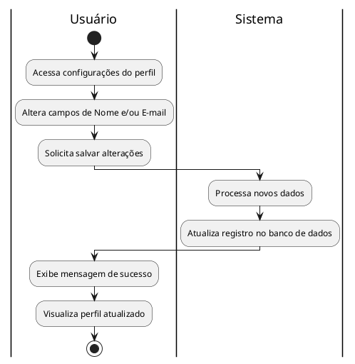
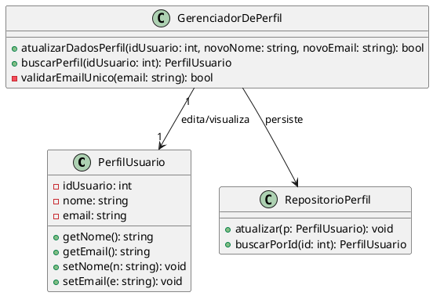

## Caso de Uso: Gerenciar Perfil

### Ator Principal
Usuário

### Objetivo
Editar informações pessoais da conta existente.

### Pré-condições
- Possuir uma sessão ativa (logado).

### Pós-condições
- Perfil atualizado no banco de dados.

### Fluxo Principal
1. Usuário acessa as configurações do seu perfil.
2. Usuário altera os campos de e-mail e nome.
3. Sistema salva as alterações no banco de dados.

### Fluxos Alternativos
- Não se aplica.

### Regras de Negócio
- Não se aplica.

### Requisitos Relacionados
- RF03 Atualização de Perfil

---

### Fluxos Detalhados
* **Fluxo Principal (Editar Perfil):** O usuário com sessão ativa acessa a área de configurações do seu perfil. Ele visualiza as informações atuais (nome e e-mail) e altera os campos desejados. Ao solicitar o salvamento, o sistema atualiza as informações do usuário diretamente no banco de dados e exibe os dados atualizados em tela.

### Diagrama de Atividades (UC06)

### Exibição de diagrama:

---

### Diagrama de Classes (UC06)

### Exibição:

---
